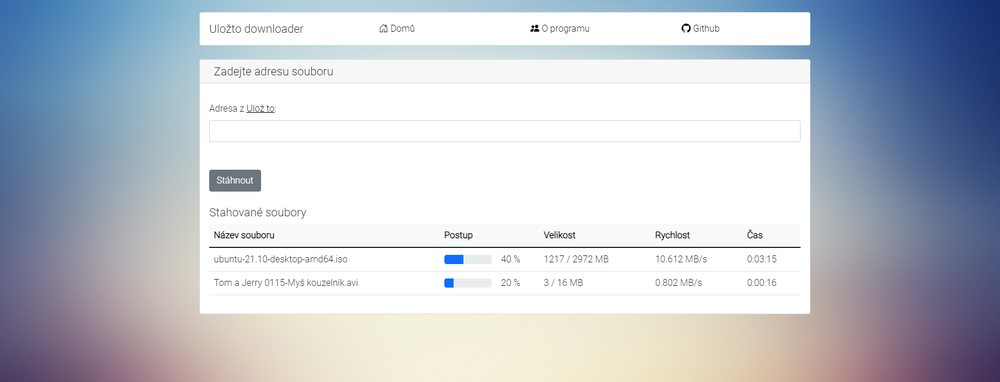
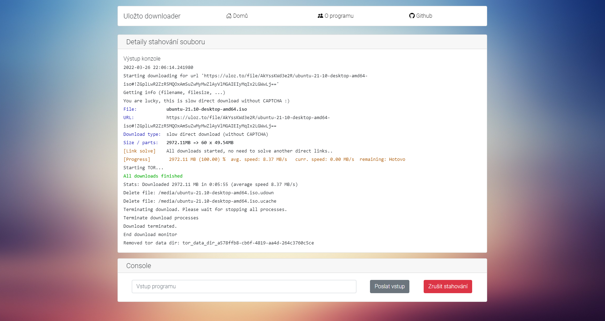

# Web pro Ulož.to downloader

Webserver pro stahovač z [Ulož.to](http://ulozto.cz) vycházející z projektu [Ulož.to downloader](https://github.com/setnicka/ulozto-downloader#ulo%C5%BEto-downloader) (credits to Jirka Setnicka) Kromě níže zmíněných omezení umí vše, co [Ulož.to downloader](https://github.com/setnicka/ulozto-downloader#ulo%C5%BEto-downloader) umí. Server spouští původní projekt v podprocesu a poté z něj čte výstup.

Tento projekt vychází z [Web pro Ulož.to downloader](https://github.com/Kvasa52/ulozto-downloader) od Kvasa52, přidává automatické optimální rozdělení na části a zobrazení
stahovaných souborů. Úpravou `flask/Dockerfile` je možné kontejner spustit na arm (např. Raspberry Pi) nebo na x64 Linuxu (výchozí nastavení).

## Klíčové vlastnosti
* Zahrnuje všechny vlastnosti z původního projektu
* Podporuje paralelní stahování
* Umí pozastavit stahování, po zadání původního odkazu ve stahování pokračuje
* Automaticky stahuje do /media

## Instalace
Pomocí Dockerfile stačí vytvořit image a následně jej spustit
```shell
$ sudo docker build -t ulozto-downloader-web .
$ docker run -p 80:5000 -v /mnt/d/Downloads:/media ulozto-downloader-web
```
## Použití
Automaticky stahuje do složky `/media`, kterou je třeba namapovat při spuštění na složku mimo Docker (např. výše pro WSL2 mapování na `D:\Downloads`). Ovládání probíhá pomocí webového prohlížeče na adrese `http://localhost/`.

Detailní výpis konzole je možné zobrazit kliknutím na název stahovaného souboru.

## Screenshoty


